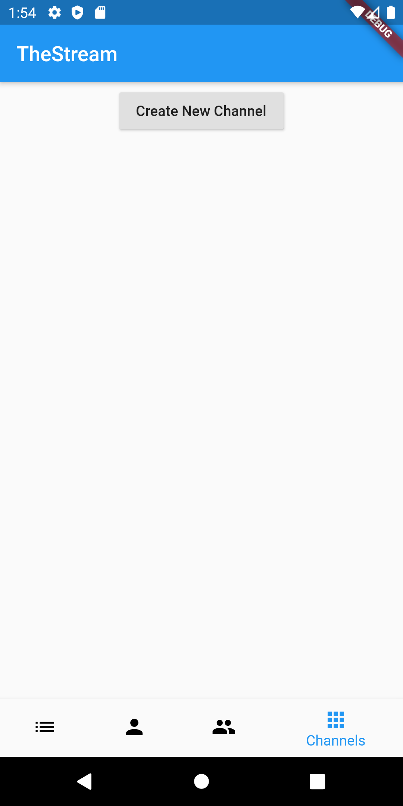
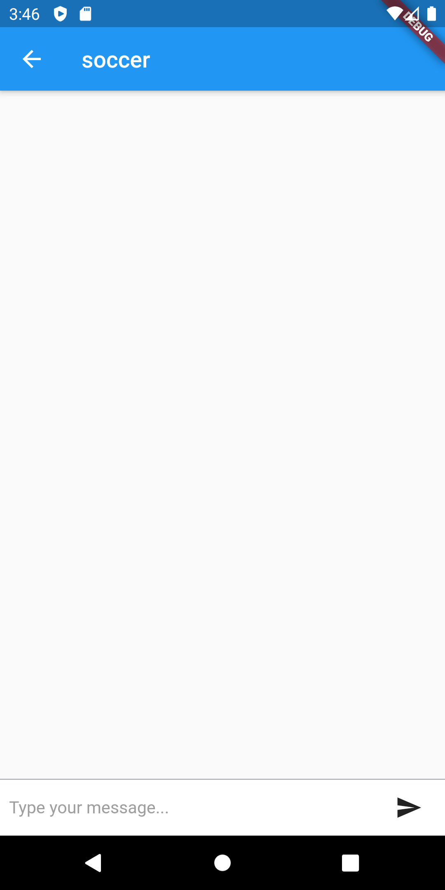
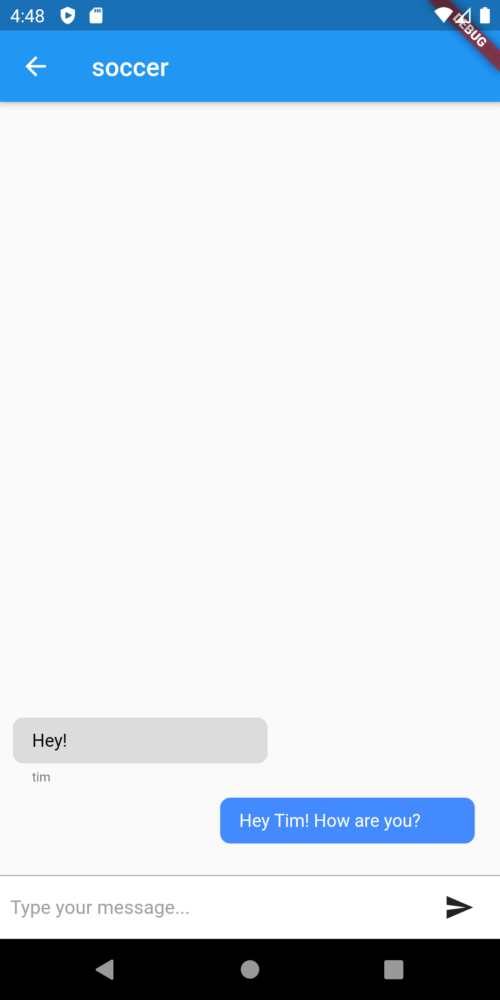
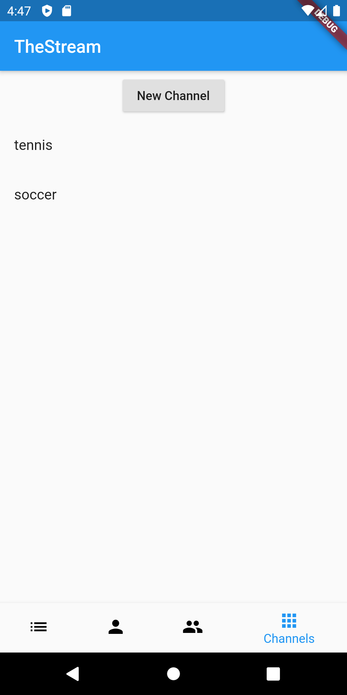

# Stream Flutter: Building a Social Network with Stream and Flutter
## Part 3: Group Channels

In the third part of our series, we're building group chat into our social application. This allows users to chat with multiple people at the same time. We leverage [Stream Chat](https://getstream.io/chat/) to do the heavy lifting. This post assumes you've gone through [part 1](https://github.com/nparsons08/stream-flutter/tree/1-social) and [part 2](https://github.com/nparsons08/stream-flutter/tree/2-messaging). 

Using our code from part 2, we only need to add to our `frontend` Flutter application, since our `backend` gives us everything we need already. To recap, the backend generates a frontend token for Stream Chat which allows the Flutter application to communicate directly with the Stream Chat API. Also, since we have direct messaging implemented, there are no additional libraries. The previously installed Stream Chat [Android](https://github.com/GetStream/stream-chat-android) and [Swift](https://github.com/GetStream/stream-chat-swift) libraries are all we need.

The app goes through these steps to enable group chat:

* User navigates to a list of chat channels they can join. To start there will be none, so they must create the first one.
* The user hits "Create Chat Channel" and generates a chat channel with an id. 
* The mobile app queries the channel for previous messages and indicates to Stream that we'd like to watch this channel for new messages. The mobile app listens for new messages.
* The user creates a new message and sends it to the Stream Chat API. Stream broadcasts this message to all users watching that channel. 
* When the message is broadcast, including messages created by the user, the mobile application consumes the event and displays the message.

We rely on Stream's Android/Swift libraries to do most of the work communicating with the API. This is done by leveraging Flutter's (Swift/Kotlin) [Platform Channels](https://flutter.dev/docs/development/platform-integration/platform-channels) to communicate with native code (Kotlin/Swift). If you'd like to follow along, make sure you get both the backend and mobile app running part 2 before continuing.

## Prerequisites

Basic knowledge of [Node.js](https://nodejs.org/en/) (JavaScript), [Flutter](https://flutter.dev/) ([Dart](https://dart.dev/)), and [Kotlin](https://kotlinlang.org/), is required to follow this tutorial. Knowledge of Swift is useful if you want to browse the iOS implementation. This code is intended to run locally on your machine. 

If you'd like to follow along, you'll need an account with [Stream](https://getstream.io/accounts/signup/). Please make sure you can run a Flutter app, at least on Android. If you haven't done so, make sure you have Flutter [installed](https://flutter.dev/docs/get-started/install). If you're having issues building this project, please check if you can create run a simple application by following the instructions [here](https://flutter.dev/docs/get-started/test-drive).

Once you have an account with Stream, you need to set up a development app (see [part 1](https://github.com/nparsons08/stream-flutter/tree/1-social)):


You'll need to add the credentials from the Stream app to the source code for it to work. See both the `mobile` and `backend` READMEs. 

First, we'll explore how a user creates a group channel.

## Step 1: Navigation
To start, we add a new navigation item to the bottom bar:



To do this, in `main.dart` we simply add a new `BottomNavigationItem`:
```dart
// mobile/lib/main.dart:120
BottomNavigationBarItem(
  icon: Icon(Icons.apps),
  title: Text('Channels'),
),
```

and the corresponding Widget to boot when the user selects that item:

```dart
// mobile/lib/main.dart:70
if (_selectedIndex == 0) {
  // other nav item widgets
} else if (_selectedIndex == 3) {
  body = Channels(account: _account);
}
```

This boots the `Channels` widget that shows a list of channels and allows the user to create a new one. 

## Step 2: Creating a group channel

When the user first arrives at this screen it will be empty if no one else has created any channels. We'll add a new channel button to the widget. Since this will be a list of group channels, we'll use a `ListView` with a single item, our new button, in it for now. We'll talk about how the `FutureBuilder` and `RefreshIndicator` with the `_channel` state in a bit. Here is the structural code with the "New Channel" button:

```dart
// mobile/lib/channels.dart:31
@override
Widget build(BuildContext context) {
  return FutureBuilder<List<dynamic>>(
    future: _channels,
    builder: (BuildContext context, AsyncSnapshot<List<dynamic>> snapshot) {
      if (!snapshot.hasData) {
        return Center(child: CircularProgressIndicator());
      }

      var tiles = [
        ListTile(
          title: Center(
            child: RaisedButton(
              child: Text("New Channel"),
              onPressed: () async {
                var channelCreated = await Navigator.push(
                  context,
                  MaterialPageRoute(builder: (_) => NewChannel(account: widget.account)),
                );

                if (channelCreated != null) {
                  _refreshChannels();
                }
              },
            ),
          ),
        )
      ];

      return RefreshIndicator(
        onRefresh: _refreshChannels,
        child: ListView(
          children: tiles,
        ),
      );
    },
  );
}
```

Our first list item is a button. When the user clicks the button we navigate to a new widget called `NewChannel`. We check the return value of `Navigator.push` to check channel creation. If it was created, we'll refresh the channel list (we'll look at it in a bit). 

Upon navigating, the user sees a form to create the channel. This is a simple widget where the user types in a channel id and creates the channel:


Let's look at the widget definition:

```dart
// mobile/lib/new_channel.dart:14
class _NewChannelState extends State<NewChannel> {
  final _channelIdController = TextEditingController();

  Future _createChannel(BuildContext context) async {
    if (_channelIdController.text.length > 0 && RegExp(r'^[a-zA-Z0-9]+$').hasMatch(_channelIdController.text)) {
      Navigator.pushReplacement(
          context,
          MaterialPageRoute(
            builder: (_) => LivestreamChat(account: widget.account, channelId: _channelIdController.text),
          ),
          result: true);
    } else {
      Scaffold.of(context).showSnackBar(
        SnackBar(
          content: Text('Please type a channel ID. It can only contain letters and numbers with no whitespace.'),
        ),
      );
    }
  }

  @override
  Widget build(BuildContext context) {
    return Scaffold(
      appBar: AppBar(
        title: Text("Create New Channel"),
      ),
      body: Builder(
        builder: (context) {
          return Container(
            padding: EdgeInsets.all(12.0),
            child: Center(
              child: Column(
                children: [
                  TextField(
                    controller: _channelIdController,
                  ),
                  RaisedButton(
                    onPressed: () => _createChannel(context),
                    child: Text("Create Channel"),
                  ),
                ],
              ),
            ),
          );
        },
      ),
    );
  }
}
``` 


Here we see a simple Flutter form, backed with a `TextEditingController`. First thing is to check is the text is a valid channel id. Stream Chat has rules around what a channel id can look like, and for simplicity, we'll just create and list channels by this id. You can refer to the [docs](https://getstream.io/chat/docs/initialize_channel/?language=js) if you'd like to add a separate channel name. 

Once a user submits a channel id, we simply navigate to the `LivestreamChannel` widget. Notice we don't create a channel in Stream here. Stream lazily creates channels upon our first interaction with them. The `LivestreamChannel` will query and watch the channel which will force its creation. Also, we use the name "Livestream" to mirror the type of channel we'll using in Stream. Livestream is the default channel type we want since in part 4 we'll implement live video into our group channel. If none of the default types work for your application, you can create your own channel types.

Here is what the user sees when first joining a group channel:



This is the most complex widget, so we'll go through this in small chunks. Remember to refer to the source if you need to see the entire file. First, let's look at our `build` method to see how we're laying out our view:

```dart
// mobile/lib/livestream_channel.dart:136
@override
Widget build(BuildContext context) {
  return Scaffold(
    appBar: AppBar(
      title: Text(widget.channelId),
    ),
    body: Builder(
      builder: (context) {
        if (_messages == null) {
          return Center(child: CircularProgressIndicator());
        }

        return Column(
          children: [
            buildMessages(),
            buildInput(context),
          ],
        );
      },
    ),
  );
}
```

This is a simple scaffold that shows the id of the channel at the top and two pieces, the message list and the new message input. When we initialize this widget, we listen to the channel, very similar to how we listened to direct message channels in part 2. We do this in the `initState` method:

```dart
// mobile/lib/livestream_channel.dart:20
@override
void initState() {
  super.initState();
  _setupChannel();
}

Future _setupChannel() async {
  cancelChannel = await ApiService().listenToChannel(widget.channelId, (messages) {
    setState(() {
      var prevMessages = [];
      if (_messages != null) {
        prevMessages = _messages;
      }
      _messages = prevMessages + messages;
    });
  });
}
```

We call the method `.listenToChannel` on the `ApiService`. This sets queries and watches the corresponding Stream channel. This means that it will give the initial set of messages, and subsequent messages to us. Every time we receive messages, we merge them into the previously displayed set. We'll see how to display these messages in a few steps.

We also store a `cancelChannel` function which allows the widget to stop listening once it's disposed of:

```dart
// mobile/lib/livestream_channel.dart:38
@override
void dispose() {
  super.dispose();
  cancelChannel();
}
```

This is important, otherwise, we'd have strange behavior due to orphaned listeners hanging around. Let's look at the implementation of `.listenToChannel`:

```dart
// mobile/lib/api_service.dart:79
Future<CancelListening> listenToChannel(String channelId, Listener listener) async {
  await platform.invokeMethod<String>('setupChannel', {'channelId': channelId});
  var subscription = EventChannel('io.getstream/events/$channelId').receiveBroadcastStream(nextListenerId++).listen(
    (results) {
      listener(json.decode(results));
    },
    cancelOnError: true,
  );

  return () {
    subscription.cancel();
  };
}
```

This is identical to how we set things up in part 3 except for the channel id. Since we're given an id by the user, we don't need to generate one. This method tells the native side to set up the channel with Stream and starts an `EventChannel` with that channel id. Once that's done, we subscribe to the [EventChannel](https://api.flutter.dev/flutter/services/EventChannel-class.html) which allows the native side to stream messages to us. We take that stream, listen to it, and parse any results that come across and pass them along to the widget.

Next we go to our `setupChannel` implementation in Kotlin. This method coordinates with Stream, establishes a channel connection, and creates an event stream to send data back to the Flutter side:

```kotlin
// mobile/android/app/src/main/kotlin/io/getstream/flutter_the_stream/MainActivity.kt:209
private fun setupChannel(result: MethodChannel.Result, channelId: String) {
  val application = this.application
  var subId: Int? = null
  val client = StreamChat.getInstance(application)
  val channel = client.channel(ModelType.channel_livestream, channelId)
  val eventChannel = EventChannel(flutterView, "io.getstream/events/${channelId}")

  eventChannel.setStreamHandler(object : EventChannel.StreamHandler {
    override fun onListen(listener: Any, eventSink: EventChannel.EventSink) {
      channel.query(ChannelQueryRequest().withMessages(25).withWatch(), object : QueryChannelCallback {
        override fun onSuccess(response: ChannelState) {
          eventSink.success(ObjectMapper().writeValueAsString(response.messages))
        }

        override fun onError(errMsg: String, errCode: Int) {
          // handle errors
        }
      })

      subId = channel.addEventHandler(object : ChatChannelEventHandler() {
        override fun onMessageNew(event: Event) {
          eventSink.success(ObjectMapper().writeValueAsString(listOf(event.message)))
        }
      })
    }

    override fun onCancel(listener: Any) {
      channel.stopWatching(object : CompletableCallback {
        override fun onSuccess(response: CompletableResponse?) {
        }

        override fun onError(errMsg: String, errCode: Int) {
          // handle errors
        }
      })
      channel.removeEventHandler(subId)
      eventChannels.remove(channelId)
    }
  })

  eventChannels[channelId] = eventChannel

  result.success(channelId)
}
```

This code is what communicates with Stream. First, we create a `Channel` object with the type `livestream` and our channel id. As described before, `livestream` is the appropriate default channel type for our group chat. It allows any user to join the channel and chat with others. 

Next, we start a Flutter [EventChannel](https://api.flutter.dev/javadoc/io/flutter/plugin/common/EventChannel.html) in Kotlin. This allows us to stream data back to the Flutter side. In our `.onListen` method, which is called when the Flutter side subscribes to the `EventChannel`, we query the channel for the initial set of messages and tell Stream to watch for future messages. This initial query will create the channel in Stream if it doesn't exist. The initial set of messages will trigger our `QueryChannelCallback` and they're sent over the `EventChannel` as a JSON string. 

To receive future messages, we need to register an event handler with the channel. This is done by calling `channel.addEventHandler`. Since we indicated we'd like to watch the channel when we did our initial query, any future messages will be sent to our `ChatChannelEventHandler` callback. We send these over the `EventChannel` as a JSON string, just like above. 

When the Flutter side indicates they'd like to cancel, the `.onCancel` is called. We simply stop watching and clean up our event handlers. Now the user is ready to send their first message.

## Step 3: Sending a message

First, we'll need an input and submit button:

```dart
// mobile/lib/livestream_channel.dart:95
Widget buildInput(BuildContext context) {
  return Container(
    margin: EdgeInsets.only(bottom: MediaQuery.of(context).padding.bottom),
    child: Row(
      children: <Widget>[
        // Edit text
        Flexible(
          child: Container(
            padding: EdgeInsets.symmetric(horizontal: 8.0),
            child: TextField(
              style: TextStyle(fontSize: 15.0),
              controller: _messageController,
              decoration: InputDecoration.collapsed(
                hintText: 'Type your message...',
                hintStyle: TextStyle(color: Colors.grey),
              ),
            ),
          ),
        ),

        // Button send message
        Material(
          child: Container(
            margin: EdgeInsets.symmetric(horizontal: 8.0),
            child: IconButton(
              icon: Icon(Icons.send),
              onPressed: _sendMessage,
            ),
          ),
          color: Colors.white,
        ),
      ],
    ),
    width: double.infinity,
    height: 50.0,
    decoration:
        BoxDecoration(border: Border(top: BorderSide(color: Colors.blueGrey, width: 0.5)), color: Colors.white),
  );
}
```

This looks hairy, but all that's happening is a simple flexible layout with two elements, an input box and a submit. The submit button is the size of the icon, and the text input is flexible which allows it to take up the remaining space. We also wrap it in a `Container` with some margin to avoid phone-specific features that take up bottom real estate, such as the home indicator on iOS.

When the user has typed a message and hit submit, we're ready to send the message to the Stream channel. Here's the implementation of `_sendMessage`:

```dart
// mobile/lib/livestream_channel.dart:44
Future _sendMessage() async {
  if (_messageController.text.length > 0) {
    await ApiService().postChannelMessage(widget.channelId, _messageController.text);
    _messageController.clear();
  }
}
```

This checks the length and passes it along to the api method `.postChannelMessage`:

```dart
// mobile/lib/api_service.dart:74
Future<bool> sendChannelMessage(String channelId, String message) async {
  await platform.invokeMethod('postChannelMessage', {'channelId': channelId, 'message': message});
  return true;
}
```

Which then passes it to the Kotlin method `.postChannelMessage`:

```kotlin
// mobile/android/app/src/main/kotlin/io/getstream/flutter_the_stream/MainActivity.kt:276
private fun postChannelMessage(result: MethodChannel.Result, channelId: String, message: String) {
  val client = StreamChat.getInstance(this.application)
  val channel = client.channel(ModelType.channel_livestream, channelId)
  val streamMessage = Message()
  streamMessage.text = message
  channel.sendMessage(streamMessage, object : MessageCallback {
    override fun onSuccess(response: MessageResponse?) {
      result.success(true)
    }

    override fun onError(errMsg: String?, errCode: Int) {
      // handle errors
    }
  })
}
```

Here we create a Stream `Message` and send it to the channel. There's not a lot for our code to do since Stream's libraries take care of the work. We simply return `true` when Stream indicates success via our callback.

## Step 4: Viewing messages

We're finally ready to view all our hard work. Since we're already listening to the channel, which was set up in part 2, all we need to do is display the messages. We create a list view that takes up the rest of the space not taken by our create message input:

```dart
// mobile/lib/livestream_channel.dart:51
Widget buildMessages() {
  return Flexible(
    child: ListView(
      padding: EdgeInsets.all(10.0),
      reverse: true,
      children: _messages.reversed.map<Widget>(buildMessage).toList(),
    ),
  );
}

Widget buildMessage(dynamic message) {
  var isMyMessage = message['userId'] == widget.account['user'];
  return Row(
    mainAxisAlignment: isMyMessage ? MainAxisAlignment.end : MainAxisAlignment.start,
    children: [
      Column(
        crossAxisAlignment: CrossAxisAlignment.start,
        children: <Widget>[
          Container(
            child: Text(
              message['text'],
              style: TextStyle(color: isMyMessage ? Colors.white : Colors.black),
            ),
            padding: EdgeInsets.fromLTRB(15.0, 10.0, 15.0, 10.0),
            width: 200.0,
            decoration: BoxDecoration(
                color: isMyMessage ? Colors.blueAccent : Colors.black12, borderRadius: BorderRadius.circular(8.0)),
            margin: EdgeInsets.only(right: 10.0),
          ),
          Container(
            margin: EdgeInsets.only(left: 15.0, top: 5.0, bottom: 10.0),
            child: isMyMessage
                ? null
                : Text(
                    message['userId'],
                    style: TextStyle(color: Colors.black54, fontSize: 10.0),
                  ),
          ),
        ],
      )
    ],
  );
}
```

This creates iOS message style bubbles with our messages on the right in blue and other user's messages on the left in grey with their name attached to the message. We reverse the list so the most recent messages are on the bottom:



## Step 5: Viewing other channels

Now a user can go back to the channel list and view all the channels, including those created by other users. Let's revisit the widget we started in Step 1 and update it so it queries and displays the list of channels:



All that's left to get this widget fully functional is plugging in the calls to `ApiService.channels` and adding those to our list view. First, when we first boot the widget in `initState`, we need to load the channels:

```dart
// mobile/lib/channels.dart:19
@override
void initState() {
  super.initState();
  _channels = ApiService().channels();
}
```

The `ApiService.channel` call simple calls do the native side and decodes the result:

```dart
// mobile/lib/api_service.dart:35
Future<List<dynamic>> channels() async {
  var result = await platform.invokeMethod<String>('getChannels', {});
  return json.decode(result);
}
```

The native implementation to retrieve channels is a similar pattern to how we query for messages above:

```kotlin
// mobile/android/app/src/main/kotlin/io/getstream/flutter_the_stream/MainActivity.kt:150
private fun getChannels(result: MethodChannel.Result) {
  val client = StreamChat.getInstance(application)
  client.queryChannels(QueryChannelsRequest(FilterObject(hashMapOf("type" to ModelType.channel_livestream)), QuerySort()), object : QueryChannelListCallback {
    override fun onSuccess(response: QueryChannelsResponse) {
      result.success(ObjectMapper().writeValueAsString(response.channels.map { it.id }))
    }

    override fun onError(errMsg: String?, errCode: Int) {
      // handle errors
    }
  })
}
```

We ask the Stream library to query all `livestream` channels. We only look for the `livestream` so we don't list the private direct messaging channels. Once the library has returned this data to us, we pass it along as a JSON string to the Flutter side.

Since our `ApiService` is returning a Future that will contain channels, we plug this `Future` into a `FutureBuilder` to deal with the state changes:

```dart
// mobile/lib/channels.dart:31
@override
Widget build(BuildContext context) {
  return FutureBuilder<List<dynamic>>(
    future: _channels,
    builder: (BuildContext context, AsyncSnapshot<List<dynamic>> snapshot) {
       // ...
    }
  );
}
```

Once that data loads, we can use the `snapshot.data` from the `FutureBuilder` to add to our `ListView` inside our `.build` method:

```dart
// mobile/lib/channels.dart:62
tiles.addAll(
  snapshot.data
      .map((channel) => ListTile(
            title: Text(channel),
            onTap: () {
              Navigator.push(
                context,
                MaterialPageRoute(
                  builder: (_) => LivestreamChat(account: widget.account, channelId: channel),
                ),
              );
            },
          ))
      .toList(),
);
```

When we click on a `ListTile`, we simply navigate to the appropriate `LivestreamChat` widget. Now a user will see all channels and be able to chat in any of them.

The last remaining piece is to plug in the `ApiService.channels` call in where we need to refresh the list. The `RefreshIndicator` calls the method `_refreshChannels` when a user pulls to refresh. We also call this when we create a channel successfully. Here's the implementation of `_refreshChannels`:

```dart
// mobile/lib/channels.dart:25
Future _refreshChannels() async {
  setState(() {
    _channels = ApiService().channels();
  });
}
```
This method simply sets the state to a new `Future` that will complete with the latest list of channels. Once that completes, we'll see the updated list. 

That's it! We now have a fully functioning group chat via Stream Channels!
